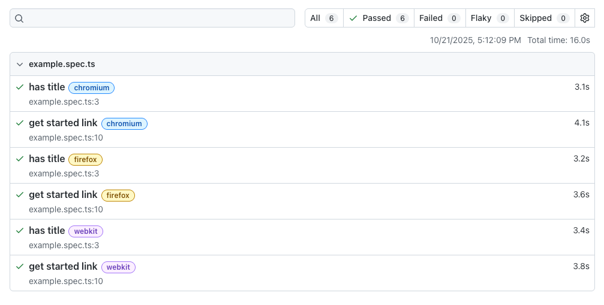

# Playwright Tutorial

## Day 1: Install and run a demo test
### What is Playwright?
- It is a modern testing framework for web apps.
- It bundles test runner, assertions, isolation, parallelization, report and rich tools.
- It can run headed or headless, and run locally or in CI.
- It supports Chromium(Chrome), Webkit(Safari), Firefox on Windows, Mac OS, Linux.
- It supports Chrome (Android) and Mobile Safari.
### Office website
- [Playwright Official Website](https://playwright.dev/)
- [Playwright GitHub](https://github.com/microsoft/playwright)

### Installation
- Install Node.js (v14 or later), my current version is `v24.9.0`

- Enter new folder `Day1`, and install Playwright using [pnpm](https://pnpm.io/):
  ```bash
  pnpm create playwright
  ```
- In terminal, it like this:
    ```bash
    jackson@192 Day1 % pnpm create playwright
    ! Corepack is about to download https://registry.npmjs.org/pnpm/-/pnpm-10.18.3.tgz
    ? Do you want to continue? [Y/n] y

    .../19a05f67588-5bba                     |   +1 +
    .../19a05f67588-5bba                     | Progress: resolved 1, reused 0, downloaded 1, added 1, done
    Getting started with writing end-to-end tests with Playwright:
    Initializing project in '.'
    ✔ Do you want to use TypeScript or JavaScript? · TypeScript
    ✔ Where to put your end-to-end tests? · tests
    ✔ Add a GitHub Actions workflow? (Y/n) · true
    ✔ Install Playwright browsers (can be done manually via 'pnpm exec playwright install')? (Y/n) · true
    Initializing pnpm project (pnpm init)…
    Wrote to /Users/jackson/Documents/Github/playwright-tutorial/Day1/package.json

    {
    "name": "Day1",
    "version": "1.0.0",
    "description": "",
    "main": "index.js",
    "scripts": {
        "test": "echo \"Error: no test specified\" && exit 1"
    },
    "keywords": [],
    "author": "",
    "license": "ISC",
    "packageManager": "pnpm@10.18.3"
    }
    Installing Playwright Test (pnpm add --save-dev @playwright/test)…
    Packages: +4
    ++++
    Progress: resolved 4, reused 0, downloaded 4, added 4, done

    devDependencies:
    + @playwright/test 1.56.1

    Done in 4.2s using pnpm v10.18.3
    Installing Types (pnpm add --save-dev @types/node)…
    Packages: +2
    ++
    Progress: resolved 6, reused 4, downloaded 2, added 2, done

    devDependencies:
    + @types/node 24.9.1

    Done in 2.9s using pnpm v10.18.3
    Writing playwright.config.ts.
    Writing .github/workflows/playwright.yml.
    Writing tests/example.spec.ts.
    Writing package.json.
    Downloading browsers (pnpm exec playwright install)…
    ✔ Success! Created a Playwright Test project at /Users/jackson/Documents/Github/playwright-tutorial/Day1

    Inside that directory, you can run several commands:

    pnpm exec playwright test
        Runs the end-to-end tests.

    pnpm exec playwright test --ui
        Starts the interactive UI mode.

    pnpm exec playwright test --project=chromium
        Runs the tests only on Desktop Chrome.

    pnpm exec playwright test example
        Runs the tests in a specific file.

    pnpm exec playwright test --debug
        Runs the tests in debug mode.

    pnpm exec playwright codegen
        Auto generate tests with Codegen.

    We suggest that you begin by typing:

        pnpm exec playwright test

    And check out the following files:
    - ./tests/example.spec.ts - Example end-to-end test
    - ./playwright.config.ts - Playwright Test configuration

    Visit https://playwright.dev/docs/intro for more information. ✨

    Happy hacking! 🎭
    ```
### Run the first test
- In terminal, run:
  ```bash
  pnpm exec playwright test
  ```
- The output like this:
    ```bash
    jackson@192 Day1 % pnpm exec playwright test

    Running 6 tests using 4 workers
    6 passed (16.0s)

    To open last HTML report run:

    pnpm exec playwright show-report
    ```
- To see the report, run:
  ```bash
  pnpm exec playwright show-report
  ```
  It will open in browser [http://localhost:9323/](http://localhost:9323/), the report like this:
  

  Close report server by `Ctrl + C` in terminal.
### Folder Structure
    ```bash
    .
    ├── node_modules    ## Project dependencies 
    │   ├── @playwright
    │   │   └── test -> ../.pnpm/@playwright+test@1.56.1/node_modules/@playwright/test
    │   └── @types
    │       └── node -> ../.pnpm/@types+node@24.9.1/node_modules/@types/node
    ├── package.json    ## Project manifest file
    ├── playwright-report   ## Report generated after test run
    │   └── index.html
    ├── playwright.config.ts    ## Playwright configuration file
    ├── pnpm-lock.yaml  ## pnpm lock file
    ├── test-results    ## Results generated after test run
    └── tests   ## Test files
        └── example.spec.ts
    ```